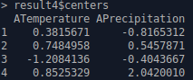
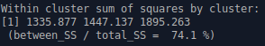
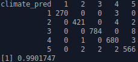

***Análisis del clima mundial***

Carlos Castellanos Mateo

Jose Manuel Pinto Lozano

Arturo Aguirre Calvo

Índice

**[Introducción](#introducción) 3**

**[Objetivos](#objetivos) 4**

**[Metodología](#metodología) 5**

**[Desarrollo](#desarrollo) 6**

> [Sample](#sample) 6
> 
> [Explore](#explore) 6
> 
> [Modify](#modify) 8
> 
> [Model](#model) 10
> 
> [Assess](#assess) 18

**[Conclusiones](#conclusiones) 23**

**[Bibliografía](#bibliografía) 24**

# 

# 

# Introducción

Mapa con climas

Clima: conjunto de condiciones atmosféricas que caracterizan una región.

Existe un agrupamiento en tipos de clima conforme a ciertas
características de la región como temperatura, lluvia, viento, etc. A
su vez dentro de cada tipo se pueden diferenciar matices más
específicos. Según la fuente y los parámetros, podemos encontrar
distintas agrupaciones, algunas de ellas son:

**Según la temperatura:**

  - > Clima cálido:
    
      - > Ecuatorial
    
      - > Tropical seco
    
      - > Subtropical árido
    
      - > Desértico
    
      - > Semidesértico

  - > **Clima templado:**
    
      - > Subtropical húmedo
    
      - > Mediterráneo
    
      - > Oceánico
    
      - > Continental

  - > **Fríos:**
    
      - > Polar
    
      - > Montaña
    
      - > Tundra

**Según las precipitaciones:**

  - > Clima árido

  - > Clima semiárido

  - > Clima subhúmedo

  - > Clima húmedo

  - > Clima muy húmedo

Además, en determinadas situaciones se pueden crear microclimas, los
cuales son climas con características distintas a las que están en la
zona en que se encuentra. Podemos diferenciar los siguientes:

  - > Urbano

  - > Incendios

  - > Erupciones

En resumen, las condiciones meteorológicas no son algo exacto y aunque
hay varias clasificaciones no se puede determinar con exactitud.

# Objetivos 

El objetivo principal de este proyecto es determinar el clima que posee
un país en función a unos datos climáticos obtenidos a lo largo de los
años, principalmente en función a temperatura y lluvias. Además de
tratar de determinar la importancia de esas variables a la hora de
clasificar, de forma que se pueda determinar que parámetros tienen mayor
relevancia a la hora de asignar un clima a un país. Por último también
se pretende estudiar cómo evoluciona el clima de algunos países a lo
largo de los años.

# Metodología

Como metodología a seguir se ha utilizado SEMMA, ya que en otras
asignaturas cursadas durante la carrera se ha seguido un procedimiento
similar y los miembros del equipo se encontraban cómodos trabajando bajo
este esquema de trabajo.

En un principio se realizaría una única iteración, pero tras realizar la
primera evaluación se descubrió que existía un problema que era
necesario solucionar en los datos. Finalmente por tanto, se han
realizado dos iteraciones, en las que se han llevado a cabo las tareas
que se comentan a continuación.

# 

# 

# 

# 

# 

# Desarrollo

A continuación, se comentan las tareas realizadas en las dos
iteraciones:

## Sample

> Para la primera iteración se obtienen datos de dos webs mediante los
> scripts *descargaClimateKnowledge.r* y *obtencionDatosTuTiempo.r,* los
> cuales almacenan los datos en archivos .csv para facilitar la lectura
> en las siguientes fases.

El script *descargaClimateKnowledge.r* obtiene los datos de temperatura
y lluvias de diferentes países a partir de los siguientes links:

  - > [**https://climateknowledgeportal.worldbank.org/api/data/get-download-data/historical/tas/1901-2016/**](https://climateknowledgeportal.worldbank.org/api/data/get-download-data/historical/tas/1901-2016/)

  - > **<https://climateknowledgeportal.worldbank.org/api/data/get-download-data/historical/pr/1901-2016/>**

A estos enlaces se les concatena el nombre del país del que se quieren
obtener los datos y utilizando el método *getURL(),* se obtiene un
*string* que debe transformarse a dataframe. Una vez conseguidos ambos
*dataframes* de cada país se unen mediante un inner join y se guarda el
*dataframe* resultante en un archivo .csv

> El script *obtencionDatosTuTiempo.r* obtiene los datos de la web:

  - > [**https:/en.tutiempo.net/climate/**](https://en.tutiempo.net/climate/)

Para ello se accede a cada continente y dentro de estos a cada país, y
dentro de estos a cada ciudad, donde aparece una tabla con los datos.
Esta tabla es cargada mediante el método *readHTMLtable(),* tras esto se
transforma dicha tabla a *dataframe* y los valores ‘-’ son sustituidos
por NA.

Por último para obtener datos agregados por países, se calculan las
medias por año de todas las variables ya que anteriormente se tenía un
ejemplo de cada año por ciudad. Tras esto se guardan los datos en un
.csv.

Tras este procedimiento el resultado serán dos conjuntos de csv, uno con
los obtenidos a través de la página
[**https://climateknowledgeportal.worldbank.org**](https://climateknowledgeportal.worldbank.org/api/data/get-download-data/historical/tas/1901-2016/)
y
**[https:/en.tutiempo.net/climate/](https://en.tutiempo.net/climate/).**

Para la segunda iteración se utilizan los csv obtenidos tras realizar el
modify de la primera iteración.

## Explore

En esta fase se analizan los datos para entender su estructura y
detectar anomalías imprevistas. Además se comienza a pensar cómo
abordarlos en el posterior procesamiento.

Por ejemplo este es el *dataset* que se obtiene de los datos
metereológicos de Canadá:

**Datos de climate knowledge:**

**Datos de tutiempo:**

> 
> 
> 

En el análisis se observa de que cuanto más atrás en el tiempo menos
datos hay, es decir, más huecos en blanco que no aportan información a
la hora del procesamiento. Y cuanto más actual es la fecha, hay una
mayor cantidad datos y de una mayor precisión. Esto es debido a que los
datos obtenidos de la web *climateknowledge* posee un histórico de datos
que comienza en 1901, mientras que los de *tutiempo* comienzan más
adelante, en este caso en 1942. Sin embargo, las variables *Temperature*
y *Rain* adquieren valores para todos los ejemplos y otras variables
podrían obtenerse a partir de esta. Por lo tanto en la fase siguiente se
crearán funciones que permitan realizar dichas operaciones.

Otro problema que se detecta observando los datos de *climateknowledge*
es que cada ejemplo del conjunto consta de la temperatura y lluvia de un
único mes, y esto puede arrojar resultados no muy precisos, ya que
climas diferentes pueden tener temperaturas o lluvias similares en meses
diferentes, o un clima puede estar determinado por que en unos meses las
temperaturas son muy bajas y en otros muy cálidas.

Con la finalidad de determinar si realmente existen diferencias en las
variables que puedan llevar a distinguir el comportamiento del clima en
los distintos países, se muestran varias gráficas que permitan comparar
las diferencias entre distintos países. Por ejemplo la temperatura entre
Noruega y Afganistán en 2016:

**Afganistán:**

**Noruega:**

Como puede observarse en las gráficas si que se aprecia una notable
diferencia entre las temperaturas medias mensuales y en la temperatura
media anual, por lo que parece razonable tratar de diferenciar los
climas en función a la temperatura.

Este es el análisis de los datos realizado en la primera iteración. Para
la segunda iteración se analizaron los datos con las modificaciones
comentadas anteriormente ya realizadas, y se vió que era necesario
normalizar los datos, debido a ello en la evaluación de la primera
iteración no se obtuvieron unos resultados satisfactorios.

En este caso haciendo uso de unas gráficas, es notable que las unidades
de medida de la temperatura y la lluvia son de una magnitud muy
diferente, por lo que será conveniente normalizar los datos antes de
aplicar un modelo:

Lluvias y temperaturas de Afganistán en 2016

## Modify

En la primera iteración, tras la fase de *Sample* se obtienen dos
conjuntos de datasets y la información acerca de un país está repartida
entre ambos, por lo que se procede a unir los datasets que pertenecen a
un mismo país. Estos conjuntos tienen diferentes países por lo tanto se
unen solo los datasets de aquellos países que aparecen en ambos
conjuntos mediante un inner join. Finalmente se obtienen 78 datasets y
cada uno de ellos contiene la información sobre temperatura y lluvias de
un país a lo largo de varios años.

Como se comentaba anteriormente, cada ejemplo poseía los datos de
temperatura y lluvias referentes a un único mes. Esto se transforma de
forma que cada ejemplo contemple las temperaturas medias de todos los
meses a lo largo de un año, creándose dos variables nuevas por cada mes,
de forma que a partir de ahora cada ejemplo consta de 12 variables de
temperatura y 12 de lluvia.

*Variables del nuevo dataset de Afganistán*

Tras hacer esta modificación se abre la puerta a la posibilidad de
agregar estos datos mensuales, en trimestrales, cuatrimestrales o
semestrales, por lo que se añaden un conjunto de funciones que permiten
dichas transformaciones.

Los datos cuentan con muchos valores nulos y para lidiar con ello se
definen una serie de funciones que permiten eliminarlos, o bien,
obtenerlos a partir de otras variables. Estas funciones permiten
calcular los valores nulos de las columnas de *ATemperature*,
*AMaxTemperature* y *AMinTemperature* utilizando los datos de la
temperatura media de cada mes en un mismo año dentro de un país; y la
columna de *TotalPrecipitation* agregando los valores de Rain.

*Variables calculadas a partir de los datos mensuales*

Dado que existen columnas que no pueden calcularse se pone a disposición
una función que elimina aquellas filas que contengan algún NA; sin
embargo para no perder demasiada información es más conveniente eliminar
aquellas columnas con un gran número de NA’s. Por ese motivo las
columnas de *AWindSpeed*, *RainDays*, *SnowDays*, *StormDays*,
*FoggyDays*, *TornadoDays* y *HailDays* son eliminadas del conjunto de
datos.

Variables finales de los datasets

Por último en la segunda iteración, se ve que las unidades de medida son
muy diferentes y estas diferencias en las magnitudes pueden llevar a que
el modelo no se ajuste de forma adecuada a los datos. Por ese motivo los
datos se normalizan previamente para después aplicar el modelo sin
problemas. Se aplica la normalización Z-Score que transforma cada
variable para que distribuya como una normal de media 0 y desviación 1.

Para la normalización Z-Score se obtiene la suma de todos los ejemplos
de cada variable, y después se divide entre el total de ejemplos sin
contar NA’s; tras esto se calcula la suma de las diferencias entre cada
ejemplo y la media al cuadrado y se divide de nuevo por el número de
ejemplos, de esta forma se obtiene la desviación. Con la media y
desviación calculadas se procede a normalizar siguiendo la siguiente
fórmula:

\(X_{i,\ Normalized} = \frac{X_{i}\  - \ Mean(X)}{Std(X)}\)

Variables normalizadas mediante Z-Score (Izquierda) y MinMax (Derecha)

Por último, se piensa en realizar distintos conjuntos para la fase de
modelado, unos utilizando todos los ejemplos de cada país y otros
agregando todos los ejemplos en un único caso por país. Dentro de estos
dos casos se decide incluir 3 conjuntos uno utilizando las variables de
temperatura media anual y lluvias medias anuales, otro agregando los 6
meses más fríos y los 6 meses más cálidos, y por último, otro utilizando
todas las variables.

## Model

En la primera iteración se utiliza únicamente un conjunto de los 6
posibles (un ejemplo por país y utilizando las variables de temperatura
media anual y lluvias medias anuales), dado que los resultados obtenidos
eran un poco extraños y se decidió pasar a la evaluación de los
resultados para comprobar su corrección.

Primeramente se ha realizado un clustering jerárquico, con el objetivo
de determinar qué cantidad de conjuntos tiene sentido realizar:

Mediante este gráfico y observando varios resultados mediante muestras
obtenidas aleatoriamente, se determina que el número más acertado de
clusters es de 4 o 5 clusters. Aplicando el algoritmo K-Means con 5
grupos como argumento se obtiene la siguiente división:

Después de realizar esta agrupación, se puede observar que los grupos se
generaban básicamente en función de las lluvias, sin tener en cuenta las
temperaturas, y por ese motivo se decidió pasar a la fase de evaluación
con la intención de comprobar si esto era correcto.

En la segunda iteración con los datos ya preparados adecuadamente para
la fase de modelado, se realiza un clustering jerárquico y de
particionamiento (k-means) para cada uno de los conjuntos. Además se ha
creado una función, para los casos en los que realiza el clustering con
un único ejemplo por país, que predice a qué grupo pertenece un
determinado sitio.

La primera prueba se realiza con un ejemplo por país, y utilizando las
variables de temperatura media anual y lluvia media anual. El clustering
jerárquico, produce el siguiente dendograma:

Observando la figura, se considera que 4 o 5 clusters serían los
adecuados para este caso, por lo que se procede aplicando el algoritmo
k-means con ambas posibilidades y los resultados obtenidos son los
siguientes.

 

Observando los resultados se ve que existen dos clusters que permanecen
prácticamente idénticos y ambos serían los casos más extremos. Y también
se ve que la diferenciación en los clusters se debe a la temperatura, ya
que aparece un cluster nuevo, con una temperatura similar a la de un
cluster existente pero con una cantidad de lluvia menor. Se considera
que esta diferenciación en la lluvia no es significativa y dado que el
cociente between\_SS / total\_SS es muy similar, se ha decidido escoger
para este caso la división en 4 clusters. Tras esta primera prueba y
tras aplicar la función que clasifica a los ejemplos, se obtiene una
posible clasificación.

La segunda prueba se realiza con todos los ejemplos, y utilizando como
variables, temperatura media en los meses fríos y cálidos, junto con la
lluvia media de los meses fríos y cálidos. El clustering jerárquico,
produce el siguiente dendograma:

Observando este dendograma, pueden considerarse buenas opciones realizar
4 o 6 clusters, pero dado que al realizar 6 habría un ejemplo que
formaría un cluster por si solo, se determina que el número más
apropiado serían 4, lo que coincide con el caso anterior. Por lo tanto
tras esto se procede a realizar un clustering partitivo utilizando
k-means y especificando 4 clusters.

La tercera prueba se realiza con un ejemplo por país, y utilizando todas
las variables. El clustering jerárquico, produce el siguiente
dendograma:

Nuevamente al igual que en el caso anterior, parece que 4 o 6 clusters
son los adecuados, pero al realizar 6, un cluster estaría formado por 3
escasos ejemplos por lo que, al igual que sucedía en las pruebas
anteriores, se decide utilizar 4 clusters, y se procede a aplicar el
algoritmo k-means.

La cuarta prueba se realiza con todos los ejemplos, y utilizando las
variables de temperatura media anual y lluvia media anual. El clustering
jerárquico, produce el siguiente dendograma:

Con este dendograma, parecen plantearse varias opciones para el número
de clusters, y por ello a continuación se realizan pruebas con 3, 4 y 5
clusters utilizando el algoritmo k-means. Tras esto se comparan los
resultados para determinar qué configuración es más adecuada para este
caso.

A la vista de estos resultados, parece claro que 3 clusters es una
cantidad poco adecuada, puesto que el coeficiente between\_SS/total\_SS
es significativamente menor a las pruebas con 4 y 5 clusters. Y respecto
a los 4 y 5 clusters, parece, dados los resultados de otras pruebas, que
ese nuevo cluster sería un subclima en el que la cantidad de lluvias es
menor, por lo que se aceptan ambas cantidades como válidas, para que en
el proceso de evaluación se determine si tiene sentido ese subclima.

La quinta prueba se realiza con todos los ejemplos, y utilizando como
variables, temperatura media en los meses fríos y cálidos, junto con la
lluvia media de los meses fríos y cálidos. El clustering jerárquico,
produce el siguiente dendograma:

Con este dendograma parece no estar claro el número de clusters más
adecuado, por lo que tomando como base los resultados obtenidos en
pruebas anteriores, se cree que 3, 4 o 5 clusters puede ser lo adecuado.
Nuevamente se debe proceder con el algoritmo k-means para comprobar cuál
de ellos otorga mejor resultado bajo el criterio del grupo.

Con estos resultados, se considera que utilizar 3 clusters no es muy
adecuado. Y entre utilizar 4 o 5, sucede igual que en la prueba
anterior, aunque esta vez sí que existe una mejora significativa.
Haciendo un pequeño análisis antes de la evaluación, parece que al
incluir todos los ejemplos sí que tiene más sentido añadir un cluster
más que representa a un subclima con una cantidad de lluvias menor. Así
que nuevamente en la evaluación se determinará qué resultado es más
adecuado.

La sexta prueba se realiza con todos los ejemplos, y utilizando todas
las variables. El clustering jerárquico, produce el siguiente
dendograma:

A la vista de este resultado, en este caso sí que el número de clusters
óptimo sería de 4, y por lo tanto, con esto se procede a aplicar el
algoritmo k-means.

Una vez realizadas las pruebas deseadas, se procede a compararlas para
determinar qué modelo puede ser el más preciso. En la mayoría de casos
se seleccionan 4 clusters a excepción de las pruebas 4 y 5, por lo que
se comparan los resultados de todos los ejemplos utilizando 4 clusters,
y los resultados de esos ejemplos utilizando 5, de forma que finalmente
se obtengan 2 modelos, uno con 4 clusters y otro con 5. Y para
determinar cuál es más adecuado, se analizaran los resultados en
comparación al mundo real en la parte de evaluación.

Para la comparación de los casos en los que se utilizan 4 clusters:

|               | Distancias y tamaño cluster 1 | Distancias cluster 2 | Distancias cluster 3 | Distancias cluster 4 | Between\_ss / Total\_ss |
| ------------- | ----------------------------- | -------------------- | -------------------- | -------------------- | ----------------------- |
| **Ejemplo 1** | **6.374259 - 23**             | **5.005531 - 20**    | **10.987729 - 26**   | **2.332884 - 9**     | **83.2 %**              |
| Ejemplo 2     | 26.630627 - 27                | 8.930582 - 10        | 10.166430 - 14       | 26.874729 - 27       | 69.6 %                  |
| Ejemplo 3     | 117.1960 - 15                 | 220.9966 - 26        | 209.3711 - 27        | 102.7152 - 10        | 66.3 %                  |
| **Ejemplo 4** | **679.3995 - 2398**           | **1322.4360 - 2951** | **428.1936 - 982**   | **845.7071 - 2717**  | **81.9%**               |
| Ejemplo 5     | 1644.046 - 1618               | 3168.449 - 3097      | 1828.805 - 1450      | 2502.799 - 2883      | 68.1 %                  |
| Ejemplo 6     | 25995.06 - 1431               | 23220.46 - 2753      | 24138.52 - 1859      | 28173.90 - 3005      | 59.9 %                  |

En la tabla se puede observar cuando los clusterings realizados con las
variables de temperatura media anual y lluvias medias anuales son los
que mejores resultados arrojan, ya que sus clusters presentan una mayor
cohesión interna (a pesar de que en el ejemplo 4 las distancias sean
mayores que en los ejemplos 2 y 3, ya que la cantidad de elementos es
mayor), y una mayor diferencia del resto de clusters como se ve en el
cociente *between\_ss / total\_ss.* Por lo tanto, los casos a analizar
más en profundidad serían el ejemplo 1 y 4. Y dado que son bastante
similares, se procederá a crear un árbol de decisión con cada una de las
clasificaciones realizadas y así analizar los resultados dados por el
árbol en la parte de evaluación.

Con respecto a los dos casos en los que 5 clusters eran considerados una
opción viable:

|               | Distancias y tamaño cluster 1 | Distancias y tamaño cluster 2 | Distancias y tamaño cluster 3 | Distancias y tamaño cluster 4 | Distancias y tamaño cluster 5 | Between\_ss / Total\_ss |
| ------------- | ----------------------------- | ----------------------------- | ----------------------------- | ----------------------------- | ----------------------------- | ----------------------- |
| **Ejemplo 4** | **249.7712**                  | **670.1883**                  | **494.7845**                  | **427.4726**                  | **755.2823**                  | **85.6 %**              |
| Ejemplo 5     | 2935.1563 - 2969              | 644.6944 - 1106               | 771.0391 - 805                | 825.1693 - 1585               | 2201.5050 - 2583              | 74.3 %                  |

Con estos resultados, nuevamente la opción más adecuada es la que
utiliza solamente las variables de temperatura media anual y lluvias
medias anuales.

A partir de ese clustering, se obtienen 3 posibles clasificaciones de
países (2 de 4 clusters, y otra de 5), y a continuación se probará a
utilizar los algoritmos decision tree y random forest. Se ha pensado en
utilizar todas las variables disponibles para ser capaces de establecer
qué variables son más importantes a la hora de determinar el clima de un
país. Para la utilización de bosques aleatorios se realizó una primera
prueba con 10, y dado que los resultados eran satisfactorios se decidió
no aumentar este valor.

Además estos árboles también pueden ser útiles para validar los
resultados del clustering y determinar qué clasificación puede ser más
adecuada. Por último comentar que en el entrenamiento se dividen los
datos para tener un conjunto de entrenamiento y otro de validación, de
forma que se pueda utilizarse la validación simple en la fase de
evaluación.

Los resultados obtenidos en cuanto a acierto han sido los siguientes:

 

*Árbol de decisión (Izquierda) y bosque aleatorio (Derecha) del ejemplo
1*

 

*Árbol de decisión (Izquierda) y bosque aleatorio (Derecha) del ejemplo
2*

 

*Árbol de decisión (Izquierda) y bosque aleatorio (Derecha) del ejemplo
3*

Como puede verse en las figuras los bosques aleatorios no arrojan
mejores resultados que los árboles de decisión por lo que se determina
que no es necesario aplicarlos puesto que los árboles de decisión son
más simples y consiguen resultados muy similares.

Finalizada la parte de modelado se procede a la evaluación de los
resultados, donde se estudiará a qué clima corresponde cada cluster, si
realmente tiene sentido utilizar 5 grupos en lugar de 4, como evoluciona
el clima de ciertas regiones y los resultados de los árboles más en
profundidad.

## Assess

En la primera iteración se utilizó esta fase para comprobar la
correctitud de los datos obtenidos del primer modelo realizado ya que no
parecía muy coherente, debido a que solo diferenciaba grupos en función
del valor de las lluvias. Como se suponía los resultados no eran
correctos, ya que bastaba con observar los ejes de las gráficas, y las
diferencias de magnitud entre las unidades de medida (milímetros cúbicos
para las lluvias y grados celsius para la temperatura), para darse
cuenta de que era lo que provocaba los malos resultados dados por el
modelo. Por lo que en base a esto se procedió a realizar una segunda
iteración.

Para comenzar la segunda iteración primeramente se trata de poner nombre
a los clusters creados y ya analizar si tiene más sentido utilizar 4 o 5
clusters.

Para nombrar los clusters, se ha prestado atención a los países que más
se repiten en cada grupo, y determinar el clima del grupo en función al
clima de esos países. Esto se hace, ya que se supone lo siguiente: si el
país A pertenece al grupo K y sabemos que A tiene un clima C con total
seguridad, entonces los países del grupo K en su mayoría tendrán el
clima C también. Para determinar el nombre de los grupos, se han usado
los climas principales según la clasificación de Köppen: tropical (A),
seco (B), templado/moderado (oceánico, subtropical y mediterráneo) (C) y
continental (D).

*Climas de los países según la clasificación de Köppen*

La clasificación para el ejemplo 1 es la siguiente:

1.  > En el primer cluster se encuentran países como Egipto, Australia o
    > Arabia Saudí entre otros, cuyos 116 años de los que se disponen
    > pertenecen a este grupo. Por lo tanto, como los países que más
    > apariciones tienen en este grupo son países que en el mapa, tienen
    > un color rojizo, se considera que este cluster corresponde a un
    > clima seco.

2.  > En este cluster se encuentran mayoritariamente países como Brasil,
    > India, Ghana o Bolivia, y prestando atención al mapa la mayoría
    > tienen partes azules que denotan un clima tropical, aunque también
    > se observa que en ocasiones este azul no es tan intenso, o que
    > dicho país posee zonas que denotan un clima templado, y esto puede
    > deberse a que el clima templado agrega también a climas
    > subtropicales. Por lo tanto, el color azul claro de las zonas
    > tropicales y que partes de los países poseen un clima templado, se
    > considera que este cluster se corresponde con un clima tropical
    > menos lluvioso, o un clima subtropical, y por ende, un clima
    > templado.

3.  > En este grupo se incluyen una gran variedad de países como
    > Noruega, Suecia, Rusia, Francia, Bélgica, Azerbaiyán o Estonia.
    > Según el mapa esto podría llevar a pensar que este grupo es el más
    > heterogéneo, ya que países como Francia o Italia tienen un clima
    > más cálido que Noruega o Rusia; sin embargo, esta agrupación
    > puede deberse a que en Europa, solo unos escasos países tienen un
    > clima más mediterráneo (templado), y debido a su proximidad a
    > países con clima continental, sus temperaturas y lluvias pueden
    > llegar a ser muy parecidas y por ello se agrupan juntos.
    > Finalmente dado que la mayor presencia en este cluster es de
    > climas continentales, se le asigna a este grupo dicho clima.

4.  > Por último el cluster con menor cantidad de elementos, que
    > contiene países como Nicaragua, Colombia o Venezuela, los cuales
    > se corresponden con zonas de climas tropicales, pero a diferencia
    > de lo que sucedía en el clúster 2, en este caso, no parece existir
    > una ligera confusión con climas templados, ya que las lluvias de
    > estos países son mucho mayores y por lo tanto, es claro que este
    > cluster se corresponde con el clima tropical.

Con la posible clasificación del ejemplo 4, los clusters son muy
parecidos, aunque es necesario cambiar el nombre ya que no poseen el
mismo orden, así el resultado sería, clima seco para el cluster 1, clima
tropical para el cluster 2, clima continental para el cluster 3 y clima
templado para el cluster 4.

Por último la agrupación que utiliza 5 clusters es muy similar, con la
única diferencia, de que los clusters que antes correspondían a climas
tropical y templado, ahora son 3 clusters, en el que se reparten en un
clima tropical muy lluvioso, clima tropical lluvioso, y clima templado.
Debido a que en el nuevo cluster solo se encuentran algunos casos de lo
que antes era o clima tropical o templado, se considera que esta
diferenciación es excesiva y puede deberse a que en ciertos años las
lluvias o temperaturas hayan tenido valores fuera de lo normal. Esta
última conclusión viene derivada del hecho de que estos 5 clusters
tienen sentido se han utilizado todos los ejemplos de cada país en lugar
de utilizar los datos agregados.

Con estas reflexiones se considera por lo tanto que sería más idóneo
utilizar 4 clusters para separar los climas. Además utilizando 4
clusters los resultados se asemejan a la realidad, ya que los países que
mayor presencia poseen dentro de un cluster tienen un clima muy similar
y este puede ser asociado con uno de los 4 climas de la clasificación de
Köppen. El clima real se obtiene a partir de \[3\].

<table>
<tbody>
<tr class="odd">
<td><table>
<thead>
<tr class="header">
<th>País</th>
<th>Clasificación</th>
<th>Real</th>
</tr>
</thead>
<tbody>
<tr class="odd">
<td>Mexico</td>
<td>Seco</td>
<td>Seco</td>
</tr>
<tr class="even">
<td>Mozambique</td>
<td>Templado</td>
<td>Tropical</td>
</tr>
<tr class="odd">
<td>Namibia</td>
<td>Seco</td>
<td>Seco</td>
</tr>
<tr class="even">
<td>Nicaragua</td>
<td>Tropical</td>
<td>Tropical</td>
</tr>
<tr class="odd">
<td>North Korea</td>
<td>Continental</td>
<td>Continental</td>
</tr>
<tr class="even">
<td>Norway</td>
<td>Continental</td>
<td>Continental</td>
</tr>
</tbody>
</table></td>
<td><table>
<thead>
<tr class="header">
<th>País</th>
<th>Clasificación</th>
<th>Real</th>
</tr>
</thead>
<tbody>
<tr class="odd">
<td>Pakistan</td>
<td>Seco</td>
<td>Seco</td>
</tr>
<tr class="even">
<td>Panama</td>
<td>Tropical</td>
<td>Tropical</td>
</tr>
<tr class="odd">
<td>Peru</td>
<td>Templado</td>
<td>Templado</td>
</tr>
<tr class="even">
<td>Poland</td>
<td>Continental</td>
<td>Continental</td>
</tr>
<tr class="odd">
<td>Qatar</td>
<td>Seco</td>
<td>Seco</td>
</tr>
<tr class="even">
<td>Russia</td>
<td>Continental</td>
<td>Continental</td>
</tr>
</tbody>
</table></td>
</tr>
</tbody>
</table>

Usando este clustering, se decide estudiar la evolución del clima en un
único país. Al realizar el proceso se ha observado un comportamiento
curioso de Italia y dada la cercanía de dicho país se procede a
analizarlo junto con algunos países de alrededor. En la siguiente tabla
se ve la evolución del clima italiano en los últimos años.

<table>
<tbody>
<tr class="odd">
<td><table>
<thead>
<tr class="header">
<th>2005</th>
<th>Continental</th>
</tr>
</thead>
<tbody>
<tr class="odd">
<td>2006</td>
<td>Seco</td>
</tr>
<tr class="even">
<td>2007</td>
<td>Seco</td>
</tr>
<tr class="odd">
<td>2008</td>
<td>Continental</td>
</tr>
<tr class="even">
<td>2009</td>
<td>Seco</td>
</tr>
<tr class="odd">
<td>2010</td>
<td>Continental</td>
</tr>
</tbody>
</table></td>
<td><table>
<thead>
<tr class="header">
<th>2011</th>
<th>Seco</th>
</tr>
</thead>
<tbody>
<tr class="odd">
<td>2012</td>
<td>Seco</td>
</tr>
<tr class="even">
<td>2013</td>
<td>Continental</td>
</tr>
<tr class="odd">
<td>2014</td>
<td>Templado</td>
</tr>
<tr class="even">
<td>2015</td>
<td>Seco</td>
</tr>
<tr class="odd">
<td>2016</td>
<td>Seco</td>
</tr>
</tbody>
</table></td>
</tr>
</tbody>
</table>

*Últimos años de Italia y todos los resumen de los casos de cada clima
de Italia*

Como se observa, Italia es un país con un clima continental que en los
últimos años está presentando características climáticas propias de un
clima seco. Prestando atención a las temperaturas y lluvias se observa
cómo mientras que la temperatura continúa aumentando, las lluvias
comienzan a disminuir.

*Temperaturas y lluvias a lo largo de los años en Italia*

Esto que sucede está contrastado en la realidad, puesto que la
temperatura media anual de muchos países está aumentando de forma
constante en los últimos años \[4\]. Una posible causa de esto puede ser
el cambio climático, pero eso sería objeto de otro estudio. Sabiendo
esto es interesante analizar el comportamiento de algunos países
cercanos, como Francia o la República Checa. Estos países siguen
clasificándose como clima continental, pero prestando atención a la
distancia que existe al cluster que representa el clima seco se observa
que se está reduciendo en los últimos años.

*Distancia al cluster “Seco”, de Francia (Izquierda) y de la República
Checa (Derecha)*

Y por último se procede a evaluar los resultados otorgados por los
árboles de decisión. Como se ha determinado anteriormente, a pesar de
realizar pruebas con 3 árboles de decisión, solo se analizarán aquellos
correspondientes a las clasificaciones de 4 grupos.

*Árboles de decisión de los ejemplos 1 (Izquierda) y 2 (Derecha)*

Como se observa en las imágenes los datos obtenidos son muy similares,
teniendo una ligera mejora el árbol que utiliza la clasificación del
ejemplo 1. La clase Seco y Templado son las que más confusiones
provocan, dado que algunos ejemplos de climas secos los clasifica como
templados, y viceversa. Esto puede deberse a que los climas secos se
caracterizan por su escasez de lluvias, y los climas templados también
tienen lluvias escasas aunque ligeramente superiores, por lo tanto si
algún año llueve menos de lo habitual, estará mucho más cercano al clima
seco.

La clase Tropical es la que mejor se clasifica, aunque algún ejemplo se
confunde con el clima templado, esto es debido a que las lluvias son muy
diferentes y las temperaturas considerablemente superiores; por lo tanto
si algún año llueve más de la cuenta o la temperatura sube, pude
producirse dicha confusión. A pesar de eso como las diferencias son
significativas esto ocurre escasas veces.

En este caso como no es interesante ni detectar todos los casos de un
clima, ni evitar errores al detectarlo, no se intenta aumentar ni
precisión ni recall.

Para finalizar con la evaluación, se procede a analizar qué variables
consideran los árboles como más significativas para determinar el clima,
aunque se ha de tener en cuenta que dado que el clustering se ha
realizado con las variables de temperatura y lluvias medias anuales,
estas tendrán una gran importancia.

*Árbol de decisión del ejemplo 1*

Como se puede observar, inicialmente el árbol utilizaba las variables
comentadas en el párrafo anterior para distinguir, y tras estas, suele
determinar las diferencias utilizando las lluvias de los meses cálidos,
como Junio y Agosto, y sobre todo temperaturas de los meses fríos como
Marzo, Enero, Diciembre o Noviembre (algunos no pueden incluirse en la
foto debido a que el árbol no podía visualizarse correctamente).

# Conclusiones

Para concluir este trabajo, comentar que el objetivo que se propuso
inicialmente, ha sido cumplido satisfactoriamente y los resultados
extraídos han sido los siguientes.

Los climas de los países presentes en los datos pueden representarse con
4 grupos, lo que concuerda con la clasificación de Köppen (el 5º clima
sería el clima frío pero no se cuentan con ejemplos de él o por lo menos
no con una cantidad significativa). Además esta clasificación es muy
buena puesto que comparando con el clima real de los países, los
resultados eran muy similares.

Además se ha puesto de manifiesto que la temperatura media anual y las
lluvias medias anuales, pueden ser suficientes para determinar el clima,
o por lo menos un conjunto de 2 posibles climas, ya que si es cierto que
se ha visto que algunos climas eran bastante similares en muchos
ejemplos (el clima templado presenta similaridades con climas secos y
otras veces con tropicales).

Analizando la tendencia se ha visto como países europeos están empezando
a mostrar síntomas de tender a climas más secos, algunos incluso desde
hace varios años. Esto si se complementara con un estudio de la
contaminación quizá podrían encontrarse las causas.

Por último utilizando los árboles se ha revalidado de nuevo la
posibilidad de determinar el clima haciendo uso de información sobre
temperatura y lluvia, además de mostrar, que otros factores muy
influyentes para esa clasificación, son las lluvias veraniegas y las
temperaturas invernales.

# Bibliografía

\[1\] Tu tiempo,
([https:/en.tutiempo.net](https://en.tutiempo.net/climate/))

\[2\] Climate Knowledge,
([https://climateknowledgeportal.worldbank.org](https://climateknowledgeportal.worldbank.org/api/data/get-download-data/historical/tas/1901-2016/))

\[3\] Climate Data,
([https://es.climate-data.org/](https://es.climate-data.org/))

\[4\] Rahmstorf, Stefan & Foster, Grant & Cahill, Niamh. (2017). Global
temperature evolution: Recent trends and some pitfalls. Environmental
Research Letters. 12. 054001. 10.1088/1748-9326/aa6825.

\[5\] RDocumentation,
([https://www.rdocumentation.org/](https://www.rdocumentation.org/))
